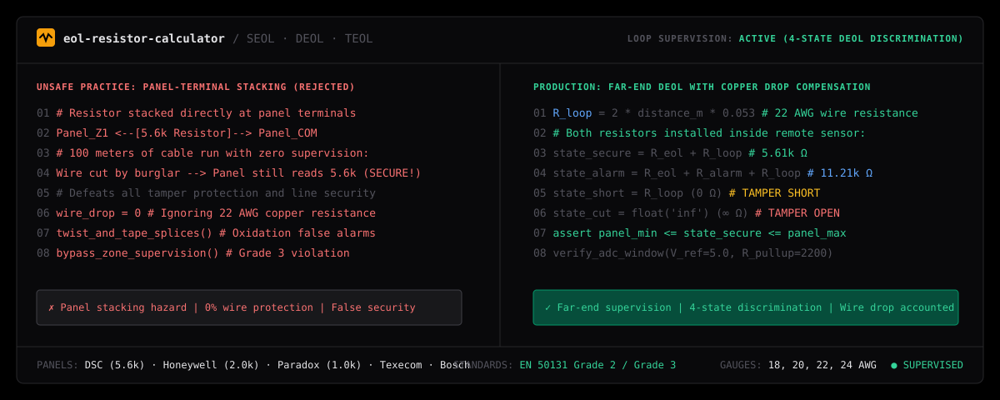

# eol-resistor-calculator

Autonomous Security Loop Supervision & EOL Resistor Calculator for AI coding agents (Claude Code, Cursor, Antigravity, Windsurf).

Calculates and validates Single (SEOL), Double (DEOL), and Triple (TEOL) end-of-line resistor loops across major security panel families (Honeywell, DSC, Paradox, Bosch, Texecom) with copper wire resistance compensation and tamper state discrimination.

```bash
npx skills add wwewtech/eol-resistor-calculator
```

**[Live Showcase & Loop Simulator](https://wwewtech.github.io/eol-resistor-calculator/)** • **[skills.sh](https://skills.sh/wwewtech/eol-resistor-calculator)** • **[SKILL.md](SKILL.md)** • **[GitHub](https://github.com/wwewtech/eol-resistor-calculator)**

---



---

## Why EOL Resistor Calculator?

Unsupervised or improperly terminated intrusion alarm loops cannot distinguish between a normally closed door, a cut wire, an active intruder, or a deliberate short-circuit sabotage. When coding agents and technicians generate security schematics without rigorous electrical models, they commit hazardous errors:

- **The Panel Stacking Blunder**: Crimping EOL resistors directly into the panel mainboard screw terminals, leaving 100 meters of field cable completely unsupervised against cuts and shorts.
- **Vendor Value Cross-Contamination**: Applying Honeywell 2.0k resistors onto a DSC panel requiring 5.6k, or Paradox 1.0k resistors onto a Texecom system, causing permanent zone faults.
- **DEOL Series/Parallel Inversion**: Reversing series and parallel resistor positions on an alarm sensor relay, causing the panel to see normal as alarm and alarm as normal.
- **Wire Resistance Blindness**: Sizing resistors without calculating two-conductor copper resistance drops on long perimeter runs (e.g. 22 AWG over 200 meters adding $\approx 21.2\ \Omega$), drifting zone voltage outside the ADC window.
- **Twist-and-Tape Oxidation**: Advising uninsulated bare wire twists and electrical tape inside detector housings, leading to corrosion and phantom false alarms.
- **Fire / Burglary Mix-up**: Confusing Normally Closed (NC) burglar DEOL tamper loops with latching Normally Open (NO) fire supervision loops.

`eol-resistor-calculator` enforces strict electrical supervision: mandatory far-end placement, 4-state DEOL truth tables, copper loop resistance compensation formulas ($R = 2 \cdot D \cdot \rho$), and manufacturer ADC acceptance windows.

---

## Transformation in Action

### Before: Hazardous Panel-Stacked Resistor Script
```python
# Unsafe: stacking resistor across panel board screw terminals
panel_terminal_z1 = "5.6k resistor"
panel_terminal_com = "5.6k resistor"

# 100 meters of field wire runs with ZERO electrical supervision!
# A burglar cutting or shorting the field wire is NEVER detected.
```

### After: Supervised Far-End DEOL with Wire Compensation
```python
# Calculate two-conductor loop resistance: 22 AWG copper over 120m
distance_m = 120.0
rho_22awg = 0.053  # Ohms per meter
r_wire_loop = 2.0 * distance_m * rho_22awg  # 12.72 Ohms

# Both resistors placed strictly inside remote detector housing:
r_eol = 5600.0     # In series with tamper loop
r_alarm = 5600.0   # In parallel with NC alarm relay

state_secure = r_eol + r_wire_loop                # 5,612.72 Ω -> SECURE
state_alarm  = r_eol + r_alarm + r_wire_loop      # 11,212.72 Ω -> ALARM
state_short  = r_wire_loop                        # 12.72 Ω -> TAMPER (SHORT)
state_cut    = float('inf')                       # ∞ Ω -> TAMPER (CUT WIRE)

# Verify against panel ADC acceptance window (DSC PowerSeries Neo: 5040Ω - 6160Ω)
assert 5040.0 <= state_secure <= 6160.0, "Zone voltage out of spec!"
```

---

## Quick Installation

### 1. Via `skills.sh` / Vercel Skills CLI
```bash
npx skills add wwewtech/eol-resistor-calculator
```

### 2. Via Claude Code
```bash
claude skills add https://github.com/wwewtech/eol-resistor-calculator
```

### 3. For Google Antigravity
Clone or copy `SKILL.md` directly into your Antigravity skills directory:
```bash
# Windows
mkdir -p "$HOME\.gemini\config\skills\eol-resistor-calculator"
curl -sL https://raw.githubusercontent.com/wwewtech/eol-resistor-calculator/main/SKILL.md -o "$HOME\.gemini\config\skills\eol-resistor-calculator\SKILL.md"

# macOS / Linux
mkdir -p ~/.gemini/config/skills/eol-resistor-calculator
curl -sL https://raw.githubusercontent.com/wwewtech/eol-resistor-calculator/main/SKILL.md -o ~/.gemini/config/skills/eol-resistor-calculator\SKILL.md
```

### 4. For Cursor & Windsurf
Add `SKILL.md` to your workspace prompt context:
```bash
mkdir -p .cursor/skills/eol-resistor-calculator
curl -sL https://raw.githubusercontent.com/wwewtech/eol-resistor-calculator/main/SKILL.md -o .cursor/skills/eol-resistor-calculator/SKILL.md
```

---

## The 10 Banned Anti-Patterns

| Anti-Pattern | Manifestation in Naive Wiring | Mandatory Production Counter-Rule |
| :--- | :--- | :--- |
| **Panel-Terminal Stacking** | Crimping EOL resistors into panel screws. | Install resistors strictly inside the remote sensor housing. |
| **Vendor Cross-Contamination** | Putting 2.0k Honeywell resistors onto DSC. | Match panel specifications (DSC: 5.6k, Vista: 2.0k, Paradox: 1.0k). |
| **DEOL Series/Parallel Swap** | Inverting series and parallel resistors. | $R_{ALARM}$ across NC alarm relay; $R_{EOL}$ in series with loop. |
| **Wire Drop Blindness** | Ignoring resistance on 200m+ warehouse runs. | Calculate $2 \times D \times \rho$ and verify against panel ADC budget. |
| **Twist-and-Tape Splices** | Twisting leads by hand with vinyl tape. | Use soldered heat-shrink sleeves or B-connectors/crimps. |
| **Fire/Burg Supervised Mix-up** | Using burglar DEOL on 2-wire smoke loops. | Fire loops strictly require Normally Open (NO) with SEOL. |
| **Unshielded AC Parallel Run** | Running 22/4 alarm wire next to 230V mains. | Maintain 300mm air gap or use shielded twisted pair (STP). |
| **Strapping Out Trouble Zones** | Twisting wires together to clear zone trouble. | Diagnose root cause methodically without bypassing supervision. |
| **Confusing NO and NC Contacts** | Treating magnetic reeds (NC) as push-buttons (NO). | Verify sensor contact behavior in quiescent, non-alarm states. |
| **Unrecorded Commissioning** | Leaving an install without recording values. | Deliver an audit log of measured loop ohms across all 4 states. |

---

## Core Mental Models & Axioms

1. **Far-End Placement Axiom**: Resistors placed anywhere other than inside the remote detector casing defeat cable tamper supervision and violate EN 50131 Grade 2/3.
2. **Double-EOL 4-State Truth Table**:
   - $0\ \Omega$ (Short) $\implies$ **Tamper (Short Circuit Sabotage)**
   - $R_{EOL}$ (Nominal) $\implies$ **Normal (Secure)**
   - $R_{EOL} + R_{ALARM}$ $\implies$ **Alarm (Intruder Tripped Relay)**
   - $\infty\ \Omega$ (Open) $\implies$ **Tamper (Cut Wire / Open Housing)**
3. **Copper Resistance Law**: Every meter of solid copper conductor adds series resistance:
   - 22 AWG: $0.053\ \Omega/\text{meter}$
   - 20 AWG: $0.033\ \Omega/\text{meter}$
   - 18 AWG: $0.021\ \Omega/\text{meter}$
4. **Manufacturer Voltage Dividers**: Zone terminal voltages represent $V_{ref} \times \frac{R_{loop}}{R_{pullup} + R_{loop}}$. Threshold margins are typically $\pm 15\%$.
5. **Zero Supervision Bypass**: Never advise bypassing supervision or strapping resistors at the control board.

---

## Production Archetypes & Presets

### Archetype 1: Loop Resistance Calculator (Python)
```python
def check_loop_budget(distance_m: float, gauge_awg: int = 22, panel_eol: float = 5600.0) -> dict:
    rho = {18: 0.021, 20: 0.033, 22: 0.053, 24: 0.084}[gauge_awg]
    wire_ohms = 2.0 * distance_m * rho
    total_secure = panel_eol + wire_ohms
    window = (panel_eol * 0.85, panel_eol * 1.15)
    return {
        "wire_loop_ohms": round(wire_ohms, 2),
        "total_secure_ohms": round(total_secure, 2),
        "is_within_tolerance": window[0] <= total_secure <= window[1]
    }
```

### Archetype 2: Reference Panel Values Matrix
```markdown
| Panel Family | SEOL Nominal | DEOL Normal | DEOL Alarm | Tamper Short | Tamper Open |
| :--- | :--- | :--- | :--- | :--- | :--- |
| **DSC PowerSeries Neo** | 5.6k Ω | 5.6k Ω | 11.2k Ω | 0 Ω | ∞ Ω |
| **Honeywell Vista** | 2.0k Ω | 2.0k Ω | 4.0k Ω | 0 Ω | ∞ Ω |
| **Paradox EVO** | 1.0k Ω | 1.0k Ω | 2.0k Ω | 0 Ω | ∞ Ω |
| **Texecom Premier** | 2.2k Ω | 2.2k Ω | 6.9k Ω | 0 Ω | ∞ Ω |
| **Bosch B Series** | 1.0k Ω | 1.0k Ω | 2.0k Ω | 0 Ω | ∞ Ω |
```

---

## The 7-Axis Pre-Emit Quality Gate

| Axis | Metric | Target Threshold |
| :--- | :--- | :--- |
| **1. Placement Safety** | Far-end detector location | 100% remote sensor enclosure |
| **2. Panel Compatibility** | Nominal resistor sizing | Matches manufacturer specifications exactly |
| **3. Wire Compensation** | Two-conductor copper drop | Calculated for runs $> 50\text{m}$ |
| **4. State Discrimination** | 4-state table coverage | Normal, Alarm, Short, Open fully mapped |
| **5. Life-Safety Protection** | Fire loop separation | Burglar DEOL strictly barred from fire loops |
| **6. Splice Integrity** | Physical connection rules | Crimp / solder sleeves over electrical tape |
| **7. Supervision Mandate** | Anti-bypass discipline | 0 instructions to bypass loop resistors |

---

## Collections & Ecosystem Inclusion

`eol-resistor-calculator` is packaged according to the open Agent Skills specification:
- **[skills.sh Directory](https://skills.sh/wwewtech/eol-resistor-calculator)**: Categorized under Hardware Engineering, Security Systems, and Electronics.
- **Anthropic & Claude Code**: Instant activation via `claude skills add`.
- **Google Antigravity**: Embedded agent workflow support.
- **Cursor & Windsurf**: Supported through `.cursorrules` and `.windsurfrules`.

---

## License

MIT © [wwewtech](https://github.com/wwewtech)
